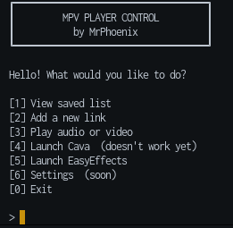

# mpvctl

&#x20;

**mpvctl** is a simple command-line utility that helps you launch and manage audio/video streams using [mpv](https://mpv.io). It offers a basic TUI-like interface, saves stream links, and optionally starts audio effects with [EasyEffects](https://github.com/wwmm/easyeffects) and a visualizer with [Cava](https://github.com/karlstav/cava).

> ⚠️ The interface is still a work in progress. Cava integration doesn't fully work yet but will be improved in future updates. And somewhere i'll clean code

---

## ✨ Features

* Save and reuse stream links (`links.json`)
* Quick launch of streams using numbered list
* Optional auto-start of EasyEffects and Cava
* JSON-based configuration (`settings.json`)
* Easy to extend and modify

---

## 📁 Project Structure

```
mpvctl/
├── cmd/
│   ├── add.go         # Add new links
│   ├── launch.go      # Launch selected stream
│   ├── list.go        # Show all saved links
│   ├── menu.go        # Interactive menu
│   └── play.go        # mpv playback logic
├── config/
│   ├── links.json     # List of saved stream links
│   ├── settings.json  # JSON config with playback options
│   └── storage.go     # JSON read/write helpers
├── go.mod             # Go module file
├── init.sh            # Setup script for Linux
├── internal/
│   └── runner.go      # mpv / cava / easyeffects execution
├── main.go            # Entry point
├── mpvctl             # Compiled binary (if built)
└── ui/
    └── banner.go      # Prints ASCII banner
```

---

## 📦 Requirements

* Go (>= 1.20)
* Linux only (no Windows support)
* `mpv` (required)
* `easyeffects` (optional)
* `cava` (optional, currently WIP)

The installer will try to detect your Linux distribution and install all dependencies for you.

> If you prefer to install manually, install: `go`, `mpv`, `cava`, and `easyeffects` via your package manager.

---

## 🔧 Installation

```bash
git clone https://github.com/MrPhoenix174/mpvctl
cd mpvctl
./init.sh    # Automatically installs dependencies and sets everything up
go run main.go
# OR, if you added it to PATH:
mpvctl
```

> The init script may ask for your password to run `sudo` commands (to install required packages).

---

## 🚀 Usage

```bash
mpvctl
```

This launches the interactive terminal interface where you can:

* See saved stream links with numbers
* Select one to play by number
* Add new links via prompts

> Command-line arguments are not supported yet.

---


---

## 🧠 Notes

* All config files are stored in the `config/` folder
* If `links.json` doesn't exist, it will be created automatically with an empty list `[]`
* The interface is minimal by design for now — it will be improved in later versions

---

## ❤️ Credits

Made with Go, mpv, and bash — by [MrPhoenix174](https://github.com/MrPhoenix174)

---

## 📸 Preview

> You can later replace this with an actual screenshot:



---

## 📬 Contributing & Issues

Coming soon.

If you try it and encounter a bug or have suggestions, feel free to open an issue or PR.
